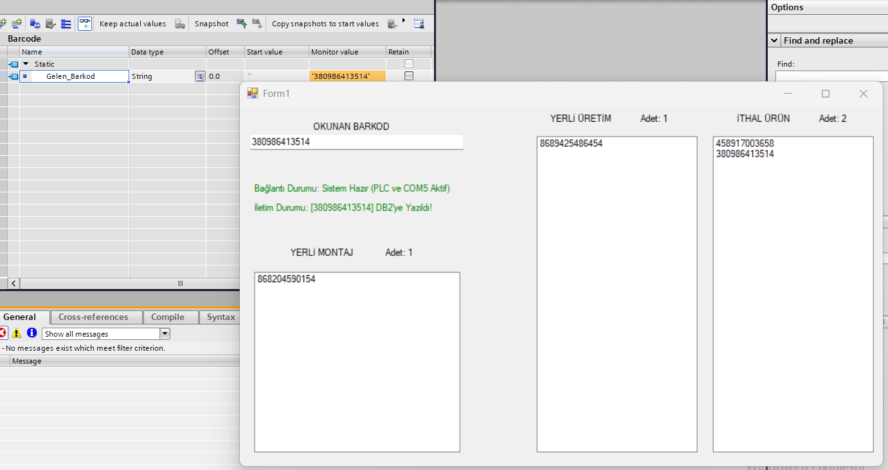

# Industrial Barcode Sorting System: PLC & Scanner Integration

##  Project Overview
This project demonstrates an industrial automation architecture integrating a **Cognex Industrial Barcode Scanner** with a **Siemens PLC**. Developed using **VB.NET**, the system acts as a custom Human-Machine Interface (HMI) that captures barcode data via serial communication, processes the information, and communicates seamlessly with the PLC to execute automated sorting mechanisms on a production line.

This repository showcases the software bridge between physical sensors (scanners) and industrial controllers (PLCs), emphasizing real-time data transfer and industrial edge integration.

##  Key Features
*   **Scanner Integration:** Captures and decodes barcode data from Cognex industrial barcode scanners via RS232 (COM Port).
*   **Real-Time PLC Communication:** Utilizes the `Sharp7` (Snap7) protocol to establish a robust, low-latency Ethernet connection with Siemens PLCs on a local industrial network (`192.168.x.x`).
*   **Automated Sorting Logic:** Parses the incoming barcode strings in real-time and categorizes products based on predefined industrial parameters (e.g., Local Production, Imported, Local Assembly).
*   **Direct Memory Access (DB Write):** Automatically converts parsed string data into the specific Siemens S7 String format (including capacity and actual length bytes) and writes directly into the PLC's Data Blocks (e.g., `DB2`) to trigger the corresponding ladder logic in **TIA Portal**.

##  System Architecture & Technologies
*   **Hardware:** Siemens S7-Series PLC, Cognex Industrial Barcode Scanner
*   **Software & Protocols:** VB.NET (Windows Forms), `Sharp7` Library, TCP/IP Communication, Serial Communication (RS232)
*   **Data Flow:** Cognex Scanner ➔ COM Port ➔ VB.NET HMI (Parsing) ➔ Sharp7 (Byte Conversion) ➔ Siemens PLC (DB Actuation)
